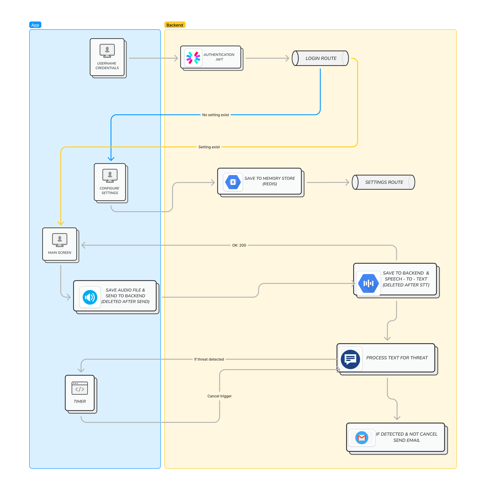

# HearMeSafe: Unlocking a Safer Tomorrow for Everyone

Imagine you're walking home alone at night, and you sense someone following you. You feel a sense of unease and fear, but you're not sure if it's just your imagination. In such a situation, you can discreetly activate HearMeSafe. The app will start recording the audio and track your location in real-time. If the situation escalates, the app will recognize the threatening speech, or, you can simply speak the safewords and trigger an alert to your trusted contact, providing him/her with the information about how threathing the situation is and location details. Even if your phone is blocked, the app will continue to record and send alerts, ensuring your safety is never compromised.

## Table of Contents
* [The Use Case](#the-use-case)
* [Arhitecture Overview](#arhitecture-overview)
* [Authentication](#authentication)
* [Arhitecture Overview](#arhitecture-overview) 
* [Recording & Classification audio](#recording--classification-audio)
* [Location Tracking](#location-tracking)
* [Identify the threat](#identify-the-threat)
* [Sending Alerts and Location](#sending-alerts-and-location)
* [Technologies Used](#technologies-used)
* [How to Run the Flutter App](#how-to-run-the-flutter-app)
* [Contributors](#contributors)
* [Resources](#resources)

## The Use Case

**HearMeSafe** is designed as a silent guardian for those moments when traditional safety measures, like panic buttons, fall short, especially when your hands aren’t free, but your voice is. 

Our app uses audio recording feature that when is turned on, it capture the threat (if it exists) and automatically send an alert to your designated contact. This alert includes your precise location and a description of the threat, ensuring your trusted friend can quickly respond and get you the help you need. It’s like having a personal safety net, ready and listening whenever you feel vulnerable. Whether you're walking home late or in an uncomfortable situation, HearMeSafe ensures you’re never truly alone.

Our Impact: With HearMeSafe, we're transforming personal safety by empowering individuals to use their voice as a tool for protection and remove the need to physically engage with your device. The user can just press the record audio button when going out and the app will continue to record and send alerts. In this way the help is accessible even when your hands are occupied or you can’t reach your phone. It’s a crucial step toward a world where everyone can move through life with confidence, knowing that help is just a word away.

## Arhitecture Overview

## Authentication

*(For now the app isn't supporting registering, only authentication. The credentials are added in the backend manually.)*  

Users access the login page, which presents an interface with fields for their username and password. 

The frontend application collects the user's credentials and packages them into a JSON format. This data is then securely transmitted to our backend service (through HTTPS), which runs on Google App Engine using FastAPI. Our FastAPI application takes special care with passwords by immediately hashing them upon receipt. The system then checks these credentials against a Google Memorystore, where we keep user information in a secure, fast-access format.
The actual verification process involves the following steps:

1. When the backend receives the login request, it first hashes the incoming password.
2. This newly created hash is compared with the one stored in our Redis database.
3. If these hashes match, our system generates a special JWT (JSON Web Token).
4. This token is created using two key pieces of information:
   - The user's username
   - A secret key that only our server knows
5. The JWT is then sent back to the frontend application, where it is stored securely and used for all future requests.

### Security Features

Our system incorporates several security best practices:

- We never store plain passwords. Everything is securely hashed.
- Google Memorystore provides ultra-fast memory-based verification.
- JWT tokens ensure secure, stateless authentication.

## Recording & Classification audio  

### Settings

After a user successfully logs in, the person can authorize the app to access the device's microphone and location services. This allows to continuously monitor the user's environment for any signs of danger. If it's the first login and there's no friend's email, user's email and safe word saved, the user is redirected to the Settings page. Here he/she can input the desired safewords, the email address of a trusted contact and his/her own email.

### Start the recording:

1.   When "Start recording" button is pressed, the app starts recording audio (~ continuously, in 5 seconds fragments) and tracking the user's location in real-time.  
2. In order to process only the relevant audio fragments, the app uses a pre-process step that involves an audio classification model (YAMNet) from Google MediaPipe. This model helps to distinguish between speech and other sounds.  
3. The audio files that are confidently classified as having the label with the best score a speech related one are selected for further processing. This ensures that the app records and send to the server only relevant data, minimizing the capture of unnecessary audio.

## Location Tracking

Alongside the audio recording, the app also continuously tracks the user's location (each 5 seconds, alltogether with the audio captioning), providing precise geospatial data that are included in the emergency alerts. When the contact person access the link which contain the location, they can use directions (the Google Maps app or webpage) to reach the user. 

## Identify the threat  

- The audio that is detected on the device to be speech related is sent to the backend for further processing. In the backend the audio file is transformed to text using the Google Cloud Speech-to-Text API. The audio file is deleted from server after this step to ensure the user's privacy and the text data alltogether with the location data and the labels from the audio classification model are used further to determine the level of threat.  
- For level of threat assessment, we use the Gemini API for which we created a tailored prompt that takes into account the recognized text, the labels from the audio classification model and the safewords. The API returns a threat level (0 - no threat and 1 - threat) and the reason for the threat level.

## Sending Alerts and Location

- If a threat is identified (Threat_response = 1), the cloud app will send a trigger to the mobile one and the mobile app will start a timer. During this time (10 seconds), the user can cancel the alert.  
- If the person will cancel the alert in 10 seconds, by pressing the Cancel Threat button, the server side will be notified and the threat process flow will end.
- If the user doesn't cancel the alert in 10 seconds, the server will go further with the threat process flow. Even if the agressor will break the phone or close it, the server app will still continue the process flow, since the only trigger in this part of the flow that is accepted by the server is the Cancel Threat one. So the only thing that the agressor can do by breaking or closing the phone is to stop de user from canceling the alert.
- In the case of processing further the threat, the server will send the reason for the threat to the next function, that uses again Gemini API to create the email notifcation (using a specific created prompt) that will be sent to the trusted contact. The created notification is then passed to a function that will add a weblink with location data incorporated in it and finally, this enriched notification is sent to the trusted contact using SendGrid API.

## Technologies Used

HearMeSafe leverages a range of technologies to achieve its goals, including the ones that apears in the functional diagram of the system:

- **Flutter**: a mobile app development framework that help us build visually-appealing, and natively-compiled applications.
- **Google App Engine**: A fully-managed serverless platform for hosting the app's backend services, ensuring scalability and reliability.
- **Cloud MemoryStore**: A fast and secure, in-memory data store that helps us store user information and verify users credentials.
- **FastAPI**: a web framework for building APIs with Python.
- **JWT (JSON Web Tokens)**: A compact and self-contained way of securely transmitting users passwords.
- **Google MediaPipe**: To enable the usage of the audio classification model (YAMNet), in the mobile application, that helps us to distinguish between speech and other sounds (Google Edge AI).
- **Google Cloud Speech-to-Text**: Helps us to convert audio to text.
- **Gemini API**: a LLM that helps us to detect the level of danger in the audio recording and the safeword.
- **SendGrid**: A cloud-based email service that allows us to send emergency alerts to the user's trusted contact.

## How to Compile the Flutter App
To compile the Flutter app, please follow the detailed instructions provided in the specific README file from the mobile app folder. The compiled app is available here on git

## How to put the backend part to Google Cloud
To recreate the functionality of the server side, used the file in the backend folder.

# Contributors

- [corneliascode](https://github.com/corneliascode)
- [terror2012](https://github.com/terror2012)
- [cojocarimiroslav](https://github.com/cojocarimiroslav)

